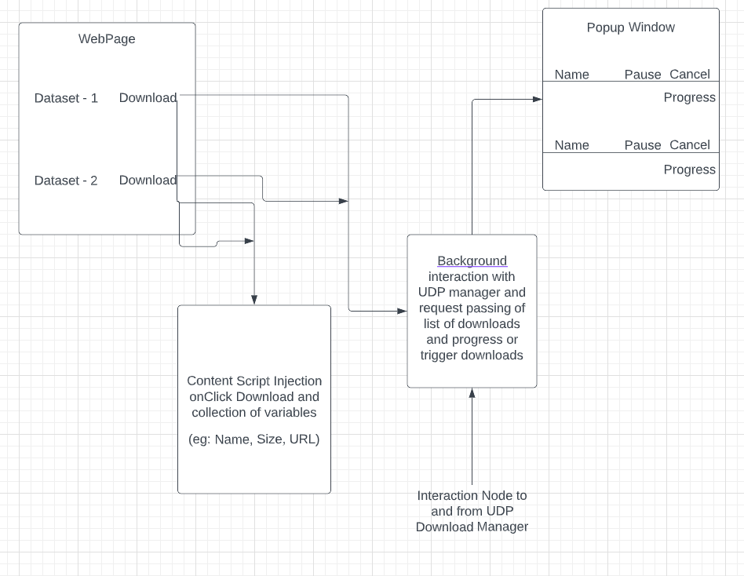
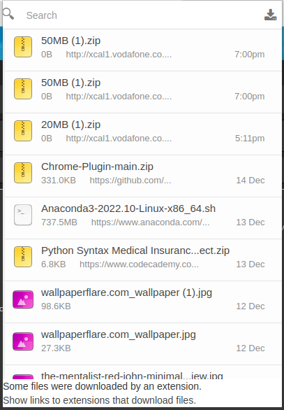
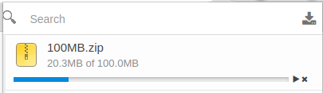
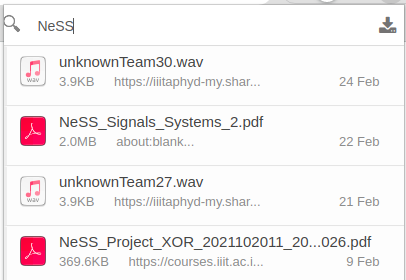

# Data Foundation - Chrome Plugin

This component of the Data Foundation Project comprises of the creation of a Browser Plugin to download datasets present on the Data Foundation website.
This plugin when integrated with the website will enable users to keep a track of the downloads along with dynamically viewing the progress of the downloads in real-time. 

This version of the Plugin (6.6.9) is made for Chrome using manifest version 2.

## Sections
- [Requirements](#requirements)
- [TechStack](#techstack)
- [Flowchart](#flowchart)
- [Components Involved](#components-involved)
    - [Manifest](#manifest)
    - [Locales](#locales)
    - [Background](#background)
    - [Popup](#popup)
- [Screeshots](#screenshots)
- [Future Releases](#future-releases)

---

## Requirements
The following are the neccessary requirements and the functionalities of the plugin.

> Functional Requirements

 
 

1. The plugin needs to work along with the data foundation website and enable users to download large data sets and keep a dynamic record of the same.

2. It needs to support download queues of large datasets at once and in real-time.

3. Users should be able to manually control the download progress by pausing/resuming at their will. It should also enable the user to cancel the download while in progress.

4. A dynamic popup window (currently developed with pure HTML, to be based on ReactJs in future releases) needs to enable user a dynamic visualization of the above features and give a UI Interface for the user to interact with.

5. A progress bar displaying the download percentage in real-time is required to estimate the download time remaining to update the user.

6. Further requirements are mentioned under [Future Releases](#future-releases) 

---

 

## TechStack

- HTML
- CSS
- JavaScript
- JSON

---
 

## Flowchart

---
 

## Components Involved

 

### Manifest

The manifest.json is the primary file of the plugin which invokes all necessary permissions and integrates all the required HTML and JavaScript files required for the functioning of the plugin.

It is currently based on Manifest Version 2 and future releases plan to upgrade this to Version 3.

 

### Locales

Locales folder contains a mini version of standardized ***English*** download related messages.

 

### Icons

The Icons folder and related files (Icons.html, icons.js) deal with the generation, plugin of designated icons into their respective places including the animation at the start of the download and mini images for each download item.

 

### Background

The Background component (Background.js) acts as a backend process. 

- It passes requests of downloads to the plugin to initiate/trigger list of downloads.

- It keeps a queue of downloads stored inside an array to handle multiple downloads at a time and sends multiple inititation requests based on the queue.

- It processes the expected downloading progress and time in real-time and passes on the data to the plugin window.

- Involves CSS handling of the downloads, their bars and icons.

  

### Popup

The related files (popup.html, popup.js and popup.css) involve with the creation of the plugin popup and its interaction with the user.

* The Script file works in integration with the background.js file to fetch the download queue to display the list of downloads in the popup window. It also fetches the download time, progress and size from the background component and displays onto the window.

* The popup.js file also manages the calls to the background script for cancellation, pausing and resuming of downloads.

* A viable search functionality is also supported via this.

 

## Screenshots

 

<a href = "#">

</a>

 

 
 

## Future Releases

The future prospects for this component comprise of the following tasks -

* Coverting the extension from version 2 to version 3.
The repository consists of a beta version (6.7.0), currently consisting of bugs.

* The plugin currently uses Chrome API to fetch and download files, the future releases plan to use the UDP (User Datagram Protocol) to download files more efficiently and with much more control over the process.

* The future release also plans to integrate the MinIO database to the extension.

* Also it will involve creation, integration and maintenance of a user database which would keep the records of the users, their access history and their history of downloads.

